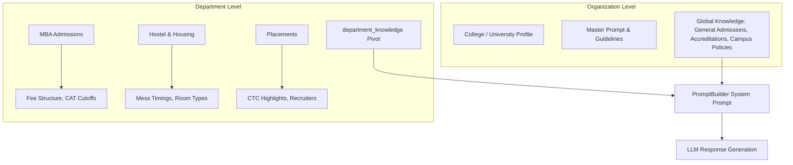

# How Knowledge is Managed in edvora.chat

The knowledge base in **edvora.chat** is designed as a **hybrid, multi-tier, vectorless knowledge engine** built specifically for higher education institutions (colleges and universities).

---

## 🏛️ 1. Organization-Level vs. Department-Level Knowledge

Knowledge in **edvora.chat** operates on a hierarchical two-tier scoping model:



* **Organization-Level (Global):**
  * Applies across all chatbots, widgets, and visitor touchpoints in the institution.
  * Controlled by the institution's Master Prompt ([`PromptBuilder.php`](file:///c:/xampp/htdocs/edvora.chat/app/Services/PromptBuilder.php)) and global sources where no department binding is specified (`is_global = true`).
  * Contains general college background, accreditation (NAAC/NIRF/AICTE), campus location, general admissions rules, and high-level contact directories.

* **Department-Level (Scoped):**
  * Handled via the [`departments`](file:///c:/xampp/htdocs/edvora.chat/architecture_department_team_management.md) table and the [`department_knowledge`](file:///c:/xampp/htdocs/edvora.chat/app/Controllers/DepartmentController.php) pivot table.
  * The system comes with **14 pre-built department templates** (e.g., *MBA Admissions, Fees & Finance, Hostel & Housing, Placements, Scholarships, International Admissions*).
  * Knowledge sources can be bound to one or more specific departments.
  * When a visitor selects a department or asks department-specific questions, [`PromptBuilder`](file:///c:/xampp/htdocs/edvora.chat/app/Services/PromptBuilder.php) injects the active department context, starter FAQs, operating hours, and relevant duty counselors into the LLM context.

---

## ⚙️ 2. How Knowledge is Managed

Knowledge is ingested, processed, and maintained via [`KnowledgeController.php`](file:///c:/xampp/htdocs/edvora.chat/app/Controllers/KnowledgeController.php) and [`workers/job_runner.php`](file:///c:/xampp/htdocs/edvora.chat/workers/job_runner.php):

1. **Multi-Channel Ingestion:**
   * **Documents**: PDF, DOCX, TXT uploads parsed by [`DocumentParser`](file:///c:/xampp/htdocs/edvora.chat/app/Services/DocumentParser.php) (using `pdftotext`).
   * **Web URLs**: Scraped and synced via [`UrlScraper`](file:///c:/xampp/htdocs/edvora.chat/app/Services/UrlScraper.php) with SHA-256 content hashing to avoid redundant processing.
   * **Direct Text Paste**: Raw text sanitization and indexing.

2. **Synchronous Compacting & Tokenizing:**
   * Handled by [`ContentCompactor::process()`](file:///c:/xampp/htdocs/edvora.chat/app/Services/ContentCompactor.php).
   * Strips web boilerplate (*"Privacy Policy"*, *"Terms of Service"*, repeated navbars).
   * Deduplicates identical lines and outputs a clean, high-density `processed_content` text block.
   * Generates single-word frequency tokens into the `keywords` column.

3. **Asynchronous LLM Semantic Phrase Enrichment:**
   * Whenever a source is created or updated, a background job (`enrich_keywords`) is queued.
   * The worker calls [`ContentCompactor::generateSemanticKeywords()`](file:///c:/xampp/htdocs/edvora.chat/app/Services/ContentCompactor.php), which uses the primary LLM to extract **10–15 intent phrases (2–5 words each)** that prospective students or parents actually type (e.g., `"hostel fee per year"`, `"CAT cutoff for MBA"`, `"merit scholarship eligibility"`).
   * Stored in `semantic_keywords` and indexed with MySQL `FULLTEXT`.

---

## 🎯 3. How the Most Relevant Info is Picked (Vectorless 3-Tier RAG)

Instead of maintaining high-latency, expensive vector databases, **edvora.chat** uses a high-performance **3-Tier Context Retrieval Engine** in [`ContentEngine::selectContext()`](file:///c:/xampp/htdocs/edvora.chat/app/Services/ContentEngine.php):

```
User Message
     │
     ▼
[Intent Classifier & Translator] (Translates non-English queries to English for retrieval)
     │
     ▼
[ContentEngine Temporal Filter] (Only active, non-expired, effective sources)
     │
     ├─► TIER 1 (Primary): MATCH(semantic_keywords) AGAINST(:query) ──► Intent Phrase Match
     │
     ├─► TIER 2 (Fallback): MATCH(title, keywords, processed_content) ─► Natural Language Search
     │
     └─► TIER 3 (Last Resort): LIKE Search across all fields
     │
     ▼
[Adaptive Context Selection] (Top 1–3 sources with score >= 30% of highest match)
     │
     ▼
[Prompt Assembly] (Injected into {{KNOWLEDGE_CONTEXT}} for LLM inference)
```

* **Tier 1 (Primary - Intent Phrase Match):** Searches against `semantic_keywords` using dedicated MySQL `FULLTEXT` indexing. Matches student intent directly against synthesized question phrases.
* **Tier 2 (Fallback - Full Document Match):** `MATCH(title, keywords, processed_content)` serves as a zero-downtime fallback while a newly uploaded document is waiting for background enrichment.
* **Tier 3 (Last Resort - LIKE Search):** Fallback for short keywords or special code terms.
* **Adaptive Scoring & Selection:** 
  * Only returns **top 1 to 3 sources** whose relevance score is $\ge 30\%$ of the top score.
  * Capping at 3 sources prevents prompt bloating, reduces token costs, and eliminates LLM hallucinations caused by irrelevant context.

---

## ⏳ 4. How Validity & Freshness is Handled

To prevent outdated fee structures, expired scholarship deadlines, or old admission cutoffs from misleading applicants, the system implements a strict **Temporal Validity Lifecycle** ([`knowledge_base_architecture.md`](file:///c:/xampp/htdocs/edvora.chat/knowledge_base_architecture.md)):

```
┌─────────────────┐      30 Days Prior      ┌─────────────────┐      Expiry Date      ┌─────────────────┐
│     ACTIVE      │ ──────────────────────► │  EXPIRING SOON  │ ────────────────────► │     EXPIRED     │
│ (Chatbot live)  │                         │ (Admin Alerted) │                       │ (Blocked by AI) │
└─────────────────┘                         └─────────────────┘                       └─────────────────┘
         │                                           │                                         │
         └───────────────────────────────────────────┴─────────────────────────────────────────┘
                                                     │ 1-Click Replace Version
                                                     ▼
                                            ┌─────────────────┐
                                            │    ARCHIVED     │ (Full lineage & audit trail)
                                            └─────────────────┘
```

1. **Real-Time Database Guardrails:**
   Every query executed by [`ContentEngine.php`](file:///c:/xampp/htdocs/edvora.chat/app/Services/ContentEngine.php) enforces strict temporal conditions:
   ```sql
   WHERE organization_id = :org_id
     AND status = 'active'
     AND (effective_from IS NULL OR effective_from <= CURDATE())
     AND (expires_on IS NULL OR expires_on >= CURDATE())
   ```
   *If a document expires at midnight, the chatbot instantly stops using it without requiring manual intervention.*

2. **Automated Health Evaluation Background Job:**
   * [`workers/job_runner.php`](file:///c:/xampp/htdocs/edvora.chat/workers/job_runner.php) periodically runs `evaluate_content_health`.
   * Automatically transitions documents expiring within 30 days to `expiring_soon` and expired documents to `expired`.

3. **Periodic Review Cycles & Health KPIs:**
   * Every source tracks `review_frequency_days` (default 180 days) and `last_reviewed_at`.
   * The admin console features a **Content Health KPI Strip** highlighting items that are *Review Due*, *No Expiry Set*, *Expiring Soon*, or *Expired*.

4. **1-Click Version Replacement & Audit Lineage:**
   * When an admission cycle ends or fees change, admins use **`POST /v1/knowledge/{id}/replace`** ([`KnowledgeController.php:replaceVersion`](file:///c:/xampp/htdocs/edvora.chat/app/Controllers/KnowledgeController.php)).
   * **Predecessor Document:** Automatically set to `status = 'archived'` with `replaced_by_id = new_id`.
   * **New Document:** Marked `status = 'active'`, tagged with the new `academic_version` (e.g. `2026-27`), linked via `previous_version_id`, and inherits existing department bindings.
   * Maintains complete document lineage and historical audit logs for university compliance and accreditation audits.
