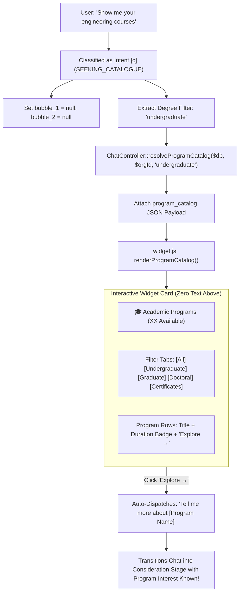
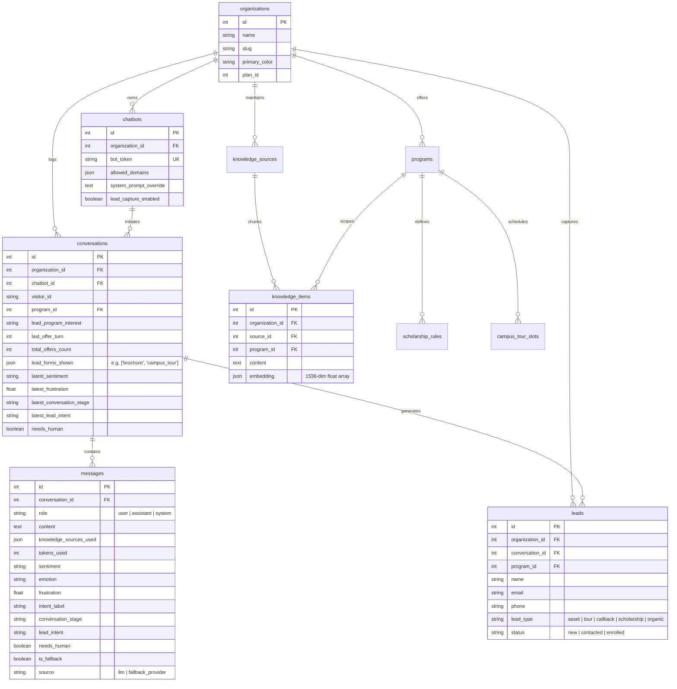

# Technical Architecture: Edvora Conversational AI & Admissions Chatbot

> **MANDATORY ONBOARDING & ARCHITECTURE GUIDE FOR HUMAN DEVELOPERS & AI CODING ASSISTANTS**
>
> This document is the canonical, authoritative technical architecture guide for the **Edvora Chatbot Subsystem**.
> It details the end-to-end chat lifecycle, 9-intent classification engine, vector retrieval engine, consultative admissions counselor state machine, 5 Cardinal Rules, anti-fatigue cadence, structured JSON output contracts, client widget mechanics, and telemetry.
>
> **Companion Master Document:** [`architecture.md`](file:///c:/xampp/htdocs/edvora.chat/architecture.md)  
> **Developer & Deployment Rules:** [`AGENTS.md`](file:///c:/xampp/htdocs/edvora.chat/AGENTS.md)  
> **UI & Styling Guidelines:** [`BRANDING_GUIDELINES.md`](file:///c:/xampp/htdocs/edvora.chat/BRANDING_GUIDELINES.md)

---

## 1. Executive Summary & Core Design Philosophy

The **Edvora Chatbot** is a specialized, multi-tenant AI conversational agent designed specifically for higher-education recruitment and admissions. Unlike generic customer support chatbots, the Edvora chatbot acts as an empathetic, consultative academic admissions counselor. It guides prospective students through program discovery, answers intricate academic questions using verified institutional knowledge, and converts high-intent prospects into qualified admissions leads.

### Core Architectural Principles:

1. **Strict 9-Intent Classification Engine (`[a]` through `[i]`):**
   Every user turn is classified into one of nine distinct intents. Each intent has deterministic execution semantics, defining whether to retrieve knowledge, trigger active discovery, propose a qualified offer, escalate to human staff, or display interactive components.
2. **Structured Dual-Bubble Output Contract:**
   The conversational engine strictly leverages native LLM `json_schema` outputs (`response_format` in OpenAI, Groq, and Gemini). Responses are delivered atomically as:
   - **`bubble_1`**: Direct factual answers or active program discovery questions.
   - **`bubble_2`**: Contextual consultative offers, rendered in the client widget with an 800ms natural typing delay.
   - **`lead_form_trigger`**: Directives to trigger lead capture modals with zero conversational text.
   - **`program_trigger`**: Directives to display the interactive program catalog with zero conversational text.
3. **Session Lead Activity Matrix & Cadence Counter:**
   The engine tracks which of the four core offers have already been presented in the current session (`counselor_callback`, `brochure`, `campus_tour`, `scholarship_calculator`) via `conversations.lead_forms_shown`. It enforces a strict cadence gate requiring at least **3 user messages (`user_message_count >= 3`)** between proactive offers.
4. **The 5 Cardinal Rules (Non-Negotiable):**
   - **Rule 1 (Zero Offers Without Program Interest):** No proactive marketing offers may ever be presented until the student's program interest is known and confirmed.
   - **Rule 2 (Active Discovery in Bubble 1):** As long as program interest is unknown, factual answers conclude with a discovery question in `bubble_1`; `bubble_2` remains strictly `null`.
   - **Rule 3 (Escalation Bypass for Distress/Human Requests):** Emotional distress (`[e]`) and requests for humans (`[f]`) bypass both the program qualification gate and the 3-turn cadence, immediately offering counselor connection.
   - **Rule 4 (Post-Lead Capture Restriction):** Once contact info is captured, all marketing offers (brochures, callbacks, scholarships) stop completely; only a `campus_tour` may be proactively offered if cadence permits.
   - **Rule 5 (Zero Text on Form & Catalog Display):** When displaying lead collection forms (Intent `[a]`) or the academic catalog (Intent `[c]`), `bubble_1` and `bubble_2` are strictly `null`. The UI component displays directly with zero conversational filler.
5. **Vector Retrieval with Program-Scoped Isolation & Lookback Resolution:**
   Retrieval operates over self-contained semantic fact chunks in `knowledge_items` using 1536-dimensional OpenAI embeddings (`text-embedding-3-small`). When an affirmative user input (e.g. *"yes, please send it to me"*) is received, the engine automatically resolves the query context from the preceding assistant message before executing vector search.

---

## 2. High-Level System Architecture

The following diagram illustrates the complete architectural topology of the Edvora chatbot subsystem:

```mermaid
flowchart TD
    subgraph ClientLayer["Client & Embedding Layer"]
        Widget["Client Browser / widget.js<br/>(Embeddable Script)"]
        PreviewUI["Admin Preview / Standalone Chat<br/>(/public/app/, /test_chat.html)"]
    end

    subgraph EntryPoint["Entry Point & Security"]
        NginxApache["Apache 2.4.58 + PHP-FPM 8.2<br/>(VirtualHost: edvora.chat)"]
        Router["App\\Core\\Router<br/>(public/index.php)"]
        DomainCheck["Domain Whitelist Validation<br/>(chatbots.allowed_domains)"]
    end

    subgraph ChatEngine["Core Chatbot Orchestrator"]
        ChatCtrl["App\\Controllers\\ChatController<br/>(complete / handleMessage)"]
        IntentClass["App\\Services\\IntentClassifier<br/>(Affirmative Lookback & Friction Detection)"]
        ProgDetect["App\\Services\\ProgramDetector<br/>(Detects course interest & syncs early leads)"]
        CadenceEngine["Cadence & 5 Cardinal Rules Evaluator<br/>(user_message_count >= 3, Program Gate, Post-Lead)"]
        PromptBld["App\\Services\\PromptBuilder<br/>(9-Intent Instructions, Knowledge Context, Session State)"]
    end

    subgraph RetrievalLayer["Knowledge Retrieval Subsystem"]
        ContentEng["App\\Services\\ContentEngine<br/>(Retrieval Cascade Orchestrator)"]
        QueryTrans["App\\Services\\QueryTranslator<br/>(Translates non-English queries to English)"]
        EmbedSvc["App\\Services\\EmbeddingService<br/>(OpenAI text-embedding-3-small)"]
        VectorEng["App\\Services\\VectorSearchEngine<br/>(Cosine similarity against knowledge_items)"]
        FulltextFallback["MariaDB FULLTEXT Fallback<br/>(knowledge_sources)"]
    end

    subgraph InferenceLayer["Multi-Provider LLM Gateway"]
        LlmSvc["App\\Services\\LlmService<br/>(complete / JSON Schema Provider)"]
        PrimaryLLM["Primary LLM Provider<br/>(OpenAI / Groq / Gemini)"]
        FallbackLLM["Fallback LLM Provider<br/>(Automatic Failover on Error/Timeout)"]
        UsageLogger["App\\Services\\LlmUsageLogger<br/>(Tokens, Latency, Cost Logging)"]
    end

    subgraph DataLayer["Persistence & Storage (MariaDB / Redis / Filesystem)"]
        DB_Chatbots[("chatbots & widget_customizations")]
        DB_Convs[("conversations<br/>(lead_forms_shown, last_offer_turn, stage)")]
        DB_Msgs[("messages<br/>(Dual-bubble tracking, sentiment, frustration, sources)")]
        DB_Leads[("leads<br/>(Contact info, program, lead type)")]
        DB_Knowledge[("knowledge_items & knowledge_sources")]
        DB_Programs[("programs, campuses, tour_slots, scholarships")]
        DB_Usage[("usage_logs & llm_usage_logs")]
    end

    Widget -->|POST /v1/chat/completions| NginxApache
    PreviewUI -->|POST /v1/chat/completions| NginxApache
    NginxApache --> Router
    Router --> DomainCheck
    DomainCheck --> ChatCtrl

    ChatCtrl --> DB_Chatbots
    ChatCtrl --> DB_Convs
    ChatCtrl --> DB_Msgs

    ChatCtrl --> IntentClass
    ChatCtrl --> QueryTrans
    QueryTrans --> ContentEng
    ContentEng --> EmbedSvc
    EmbedSvc --> VectorEng
    VectorEng --> DB_Knowledge
    ContentEng -.->|Fallback| FulltextFallback

    ChatCtrl --> ProgDetect
    ProgDetect --> DB_Programs
    ProgDetect --> DB_Leads

    ChatCtrl --> CadenceEngine
    ChatCtrl --> PromptBld
    PromptBld --> LlmSvc

    LlmSvc --> PrimaryLLM
    PrimaryLLM -.->|Failover| FallbackLLM
    LlmSvc --> UsageLogger
    UsageLogger --> DB_Usage

    ChatCtrl --> DB_Msgs
    ChatCtrl --> DB_Convs
    ChatCtrl -->|JSON Response (dual-bubble / triggers)| Widget
```

---

## 3. End-to-End Chat Turn Lifecycle

Every incoming chat turn is processed synchronously by [`App\Controllers\ChatController::complete()`](file:///c:/xampp/htdocs/edvora.chat/app/Controllers/ChatController.php) via route `POST /v1/chat/completions`.

```mermaid
sequenceDiagram
    autonumber
    actor Visitor as Prospective Student (Widget)
    participant CC as ChatController
    participant IC as IntentClassifier
    participant CE as ContentEngine (Vector Search)
    participant PD as ProgramDetector
    participant PB as PromptBuilder
    participant LLM as LlmService (Multi-Provider)
    participant DB as MariaDB (conversations, messages, leads)

    Visitor->>CC: POST /v1/chat/completions {bot_token, visitor_id, message}
    Note over CC: 1. Validate bot_token, org status & allowed domains
    CC->>DB: 2. Query / Upsert conversation session & read `lead_forms_shown`
    CC->>DB: 3. INSERT user message into `messages`
    CC->>DB: 4. Fetch last 6 messages (context sliding window)
    
    CC->>IC: 5. Check if affirmative agreement ("yes", "send it", "call me")
    opt Affirmative User Reply
        IC-->>CC: Resolve retrieval context from prior assistant message
    end

    CC->>CE: 6. Vector search over `knowledge_items` (scoped by program_id if known)
    CE-->>CC: Return top relevant knowledge sources

    CC->>PD: 7. Detect academic program interest from query + context
    opt Program Detected
        PD->>DB: Persist program lead to `conversations` & `leads`
    end

    Note over CC: 8. Calculate Cadence Counter:<br/>user_message_count = max(0, turnCount - last_offer_turn)

    CC->>PB: 9. Build Prompt with 5 Inputs:<br/>Knowledge + Visitor State + Lead Activity + Cadence + 6 Messages
    CC->>LLM: 10. Complete prompt with Admissions JSON Schema
    LLM-->>CC: Return JSON {intent, bubble_1, bubble_2, lead_form_trigger, program_trigger...}

    alt Intent [a] or Affirmative Agreement
        CC->>CC: 11a. Set bubble_1 = null, bubble_2 = null; resolve lead form trigger
    else Intent [c] or Catalog Trigger
        CC->>CC: 11b. Set bubble_1 = null, bubble_2 = null; resolve interactive catalog card
    else Intent [g] Complaint / Status Check
        CC->>CC: 11c. Present polite staff connection prompt in bubble_1; bubble_2 = null
    else Intent [e] or [f] Escalation
        CC->>CC: 11d. Flag needs_human = 1, bypass cadence, offer counselor callback
    else Intent [b] or [d] Q&A
        CC->>CC: 11e. Validate bubble_2 against 5 Cardinal Rules & user_message_count >= 3
    end

    opt Follow-Up Offer Accepted or Presented
        CC->>DB: Update `conversations.lead_forms_shown` & `last_offer_turn`
    end

    CC->>DB: 12. INSERT assistant messages into `messages`
    CC->>DB: 13. UPDATE conversations (sentiment, frustration, stage, needs_human)
    CC->>DB: 14. UPDATE usage_logs (messages_count, tokens_used)

    CC-->>Visitor: 15. Return HTTP 200 JSON payload
    opt Interactive Form or Catalog (Zero Text)
        Visitor->>Visitor: Render form/catalog directly with zero text bubbles
    end
    opt Dual-Bubble Response
        Visitor->>Visitor: Render bubble_1 -> 800ms delay -> render bubble_2
    end
```

### Detailed Turn Processing Steps:

1. **Authentication & Whitelist Validation:**
   Verifies `bot_token` against `chatbots`. Ensures `is_active = 1` and checks `chatbots.allowed_domains` against HTTP `Origin` / `Referer`.
2. **Session Resolution & Anti-Fatigue State:**
   Retrieves or creates the conversation in `conversations` using `visitor_id`. Reads current cadence indicators: `last_offer_turn`, `total_offers_count`, `lead_captured_at`, `lead_program_interest`, `program_id`, and `lead_forms_shown` (JSON array of offers previously shown).
3. **User Message Logging:**
   Persists user prompt in `messages` with `role = 'user'`, `source = 'user'`, and timestamp.
4. **Context Sliding Window:**
   Extracts strictly the last 6 messages (`LIMIT 6`, reversed) to maintain dialogue history without exceeding prompt token budgets.
5. **Affirmative Query Lookback:**
   If the user replies affirmatively (*"yes"*, *"sure"*, *"please send it to me"*, *"call me"*), [`IntentClassifier::isAffirmativeResponse()`](file:///c:/xampp/htdocs/edvora.chat/app/Services/IntentClassifier.php) inspects the preceding assistant message. Vector retrieval uses the content of the prior assistant offer rather than the bare word *"yes"*, guaranteeing high-relevance context retrieval.
6. **Query Translation & Knowledge Retrieval:**
   Non-English queries are translated to English via [`QueryTranslator`](file:///c:/xampp/htdocs/edvora.chat/app/Services/QueryTranslator.php) strictly for search indexing. [`ContentEngine::selectContext()`](file:///c:/xampp/htdocs/edvora.chat/app/Services/ContentEngine.php) executes vector search, scoped to `currentProgramId` if known.
7. **Proactive Program Interest Detection & Early Lead Sync:**
   [`ProgramDetector::detect()`](file:///c:/xampp/htdocs/edvora.chat/app/Services/ProgramDetector.php) scans query tokens against active `programs`. If identified, it synchronizes `conversations.lead_program_interest` and upserts an early lead record in `leads`.
8. **Cadence Counter Calculation:**
   Calculates `user_message_count = max(0, turnCount - last_offer_turn)`. This measures how many user messages have transpired since the assistant last made an offer.
9. **Dynamic Prompt Assembly (5 Structured Inputs):**
   [`PromptBuilder::build()`](file:///c:/xampp/htdocs/edvora.chat/app/Services/PromptBuilder.php) formats:
   - **Knowledge Context:** Top retrieved fact chunks.
   - **Visitor State:** Program interest known (`Yes: "Program Name"` / `No`), Lead contact captured (`Yes` / `No`).
   - **Lead Activity Matrix:** Yes/No status for Counselor Callback, Brochure, Campus Tour, and Scholarship Calculator.
   - **Cadence Counter:** `user_message_count since last offer`.
   - **Recent Dialogue:** Strictly past 6 messages.
10. **Structured LLM Invocation:**
    Calls [`LlmService::complete()`](file:///c:/xampp/htdocs/edvora.chat/app/Services/LlmService.php) with the strict Admissions Response JSON Schema.
11. **JSON Decoding & Intent Execution:**
    Extracts `intent`, `bubble_1`, `bubble_2`, `lead_form_trigger`, `program_trigger`, and analytics. Executes intent-specific rules:
    - **Intent `[a]` (Accepting Previous Offer):** `bubble_1` and `bubble_2` are set to `null`; triggers the appropriate lead form modal with zero conversational text.
    - **Intent `[c]` (Seeking Catalogue):** `bubble_1` and `bubble_2` are set to `null`; triggers the interactive program catalog card with zero conversational text.
    - **Intent `[g]` (Complaint / Status Check):** Delivers polite staff connection question in `bubble_1`; `bubble_2` remains `null`.
    - **Intent `[e]` & `[f]` (Distress / Human Request):** Flags `needs_human = 1`, bypasses cadence and program rules, and offers counselor callback.
    - **Intent `[b]` & `[d]` (Q&A):** Answers factually in `bubble_1`. If program interest is unknown, asks for their degree in `bubble_1` and sets `bubble_2 = null`. If program is known, verifies `user_message_count >= 3` before allowing `bubble_2`.
12. **Cadence Enforcement & Session Tracking:**
    If `bubble_2` is permitted or an offer is triggered, the offer type is appended to `lead_forms_shown`, and `last_offer_turn` is updated to the current turn count.
13. **Response Persistence & Client Dispatch:**
    Persists assistant message(s) to `messages` table and emits JSON response to `widget.js`.

---

## 4. Structured Admissions Output Contract & Response Schema

Edvora enforces strict JSON schema mode on all chat completions. The schema is defined in [`LlmService::getAdmissionsResponseSchema()`](file:///c:/xampp/htdocs/edvora.chat/app/Services/LlmService.php).

### 4.1 Schema Definition

```json
{
  "name": "admissions_response",
  "strict": true,
  "schema": {
    "type": "object",
    "additionalProperties": false,
    "required": [
      "intent",
      "bubble_1",
      "bubble_2",
      "lead_form_trigger",
      "program_trigger",
      "sentiment",
      "emotion",
      "frustration",
      "conversation_trend",
      "conversation_stage",
      "lead_intent",
      "needs_human"
    ],
    "properties": {
      "intent": {
        "type": "string",
        "enum": ["a", "b", "c", "d", "e", "f", "g", "h", "i"],
        "description": "Classification into one of the 9 admissions intents."
      },
      "bubble_1": {
        "type": ["string", "null"],
        "description": "Primary conversational answer bubble. Plain text, direct factual answer, or active discovery question. Must be null if triggering a form or catalog."
      },
      "bubble_2": {
        "type": ["string", "null"],
        "description": "Secondary proactive counselor bubble. Proposes next step or qualified offer. Must be null if program interest is unknown or cadence is not met."
      },
      "lead_form_trigger": {
        "type": ["string", "null"],
        "enum": ["counselor_callback", "brochure", "campus_tour", "scholarship_calculator", null],
        "description": "Fires ONLY when visitor explicitly agrees to or requests an offer."
      },
      "program_trigger": {
        "type": ["string", "null"],
        "enum": ["all", "undergraduate", "graduate", "doctoral", "certificates", null],
        "description": "Fires when visitor asks for course catalog / list of programs."
      },
      "sentiment": {
        "type": "string",
        "enum": ["positive", "neutral", "negative"]
      },
      "emotion": {
        "type": "string",
        "description": "e.g. interested, confused, stressed, excited, anxious, frustrated"
      },
      "frustration": {
        "type": "number",
        "description": "Float from 0.0 (completely calm) to 1.0 (highly frustrated)"
      },
      "conversation_trend": {
        "type": "string",
        "enum": ["improving", "stable", "declining"]
      },
      "conversation_stage": {
        "type": "string",
        "enum": ["discovery", "consideration", "decision", "application"]
      },
      "lead_intent": {
        "type": "string",
        "enum": ["low", "medium", "high"]
      },
      "needs_human": {
        "type": "boolean",
        "description": "True if visitor expresses extreme frustration, human request, or complex complaint"
      }
    }
  }
}
```

### 4.2 Multi-Bubble UI Model & Zero-Text Directives

| Component | Role & Client Timing | Zero-Text Directive |
|---|---|---|
| **Bubble 1 (`bubble_1`)** | Factual answer to user inquiry, or active discovery question when program interest is unknown. Rendered immediately. | Set to `null` when opening a lead collection form (`[a]`) or displaying the catalog card (`[c]`). |
| **Bubble 2 (`bubble_2`)** | Consultative counselor offer nudging the student toward next steps. Rendered **800ms later** in the widget with an animated typing indicator bounce. | Set to `null` if program interest is unknown, if `user_message_count < 3`, or if lead contact has already been captured (unless offering a tour). |
| **Lead Form Modal** | Interactive inline form (Name, Email, Phone/WhatsApp). | Renders directly in widget with zero conversational text bubble above it. |
| **Program Catalog Card** | Interactive degree-filtered card showing program titles, durations, and *"Explore →"* action buttons. | Renders directly in widget with zero conversational filler text. |

---

## 5. The 9-Intent Classification Engine & The 5 Cardinal Rules

### 5.1 The 9-Intent Classification Matrix:

| Intent Key | Intent Name | Trigger Condition / Example Queries | Executed Actions & Output Constraints |
|---|---|---|---|
| **`[a]`** | **ACCEPTING_PREVIOUS_OFFER** | User agreed to or requested the previous assistant offer (*"yes"*, *"sure"*, *"please send it to me"*, *"send it"*, *"call me"*, *"book a tour"*). | `intent: "a"`<br/>`bubble_1: null`<br/>`bubble_2: null`<br/>`lead_form_trigger`: set to accepted offer type (`"counselor_callback"`, `"brochure"`, `"campus_tour"`, `"scholarship_calculator"`). |
| **`[b]`** | **INFORMATION_SEEKING** | User asks a specific factual question (fees, eligibility, dates, campus facilities, hostel, etc.). | `intent: "b"`<br/>1. Answer factually in `bubble_1`.<br/>2. If Program Interest is **No**: append discovery question to `bubble_1`; `bubble_2: null`.<br/>3. If Program Interest is **Yes** & cadence met: propose offer in `bubble_2`. |
| **`[c]`** | **SEEKING_CATALOGUE** | User wants to see all courses, degree programs, or academic departments (*"show me courses"*, *"what programs do you offer?"*). | `intent: "c"`<br/>`bubble_1: null`<br/>`bubble_2: null`<br/>`program_trigger`: `"all"`, `"undergraduate"`, `"graduate"`, `"doctoral"`, or `"certificates"`. |
| **`[d]`** | **DISCOVERY_EXPLORATION** | User is exploring options, comparing career paths, or seeking general guidance (*"I like coding and biology, what should I study?"*). | `intent: "d"`<br/>1. Answer helpfully in `bubble_1`.<br/>2. If Program Interest is **No**: conclude `bubble_1` asking for study interests; `bubble_2: null`.<br/>3. If Program Interest is **Yes** & cadence met: propose offer in `bubble_2`. |
| **`[e]`** | **EMOTIONAL_DISTRESS** | User expresses anger, frustration, dissatisfaction, or strong negative emotion (*"Nobody is helping me"*, *"This website is broken"*). | `intent: "e"`<br/>Cadence and program rules **bypassed**.<br/>Empathize calmly in `bubble_1` and immediately ask to arrange a callback in `bubble_2`. `needs_human: true`. |
| **`[f]`** | **WANTS_HUMAN** | User explicitly asks for a human, admissions officer, or representative (*"Can I speak with a human?"*, *"I want to talk to an advisor"*). | `intent: "f"`<br/>Cadence and program rules **bypassed**.<br/>Acknowledge in `bubble_1` and offer admissions callback in `bubble_2`. `needs_human: true`. |
| **`[g]`** | **COMPLAINT_OR_STATUS_CHECK** | User reports an issue, error, grievance, or inquires about existing application status (*"Where is my application?"*, *"I submitted fees but got no receipt"*). | `intent: "g"`<br/>`bubble_1`: *"Do you want me to connect you to the appropriate staff to get you the correct information or pass along your suggestion/complaint?"*<br/>`bubble_2: null`, `lead_form_trigger: null`. When user replies *"Yes"*, next turn flows to Intent `[a]` to open form with zero text. |
| **`[h]`** | **OUT_OF_SCOPE** | Casual greetings or questions unrelated to the university (*"Hi"*, *"What is the weather?"*). | `intent: "h"`<br/>`bubble_1`: Warm redirect to university programs and admissions.<br/>`bubble_2: null`, `lead_form_trigger: null`. |
| **`[i]`** | **SENSITIVE_OR_HIGH_RISK** | Abusive, legal, safety, or hazardous topics. | `intent: "i"`<br/>`bubble_1`: Polite refusal and redirect to official university admissions.<br/>`bubble_2: null`, `lead_form_trigger: null`. |

---

### 5.2 The 5 Cardinal Rules (Non-Negotiable):

```mermaid
flowchart TD
    Start["Incoming User Turn"] --> CheckDistress{Is Intent [e] Distress<br/>or [f] Wants Human?}
    
    CheckDistress -->|Yes| Bypass["Bypass Program & Cadence Gates<br/>Offer Counselor Callback Immediately"]
    
    CheckDistress -->|No| CheckProg{Is Program Interest Known?}
    
    CheckProg -->|No| Rule1["Rule 1: ZERO OFFERS<br/>Rule 2: Active Discovery in Bubble 1<br/>Bubble 2 strictly NULL"]
    
    CheckProg -->|Yes| CheckLead{Is Lead Contact Already Captured?}
    
    CheckLead -->|Yes| Rule4["Rule 4: POST-LEAD RESTRICTION<br/>All marketing offers STOP.<br/>ONLY Campus Tour permitted (if cadence met)"]
    
    CheckLead -->|No| CheckCadence{user_message_count >= 3<br/>since last offer?}
    
    CheckCadence -->|No| WaitCadence["Cadence Cooldown Active<br/>Answer factually in Bubble 1<br/>Bubble 2 strictly NULL"]
    
    CheckCadence -->|Yes| PresentOffer["Present Contextual Offer in Bubble 2<br/>(Brochure / Tour / Callback / Scholarship)<br/>Increment lead_forms_shown & reset cadence"]
```

1. **Cardinal Rule 1: Zero Offers Without Program Interest:**
   - Absolutely NO proactive offer (Brochure, Scholarship Calculator, Campus Tour, or Counselor Callback) may be proposed until the visitor's program interest is identified.
   - If the user explicitly asks for an offer upfront before their program interest is known (e.g. *"Can I get a scholarship?"* or *"Can I visit?"*), answer their question and immediately ask for their program of interest in `bubble_1` (e.g. *"I'd be glad to help you evaluate your scholarship! Which program are you planning to apply for?"*). Do NOT open the form yet.
2. **Cardinal Rule 2: Active Discovery in Bubble 1:**
   - As long as `Program Interest Known` is `No`, conclude factual answers in `bubble_1` with a natural guiding question to discover their intended degree or field of study (e.g. *"...Which field or degree are you considering?"*).
   - `bubble_2` must remain strictly `null` until program interest is identified.
3. **Cardinal Rule 3: Escalation Bypass for Emotional Distress & Human Requests (Intents `[e]` & `[f]`):**
   - If the visitor is angry, frustrated, or explicitly asks for a human, the program interest requirement and the 3-message cadence rule are **BOTH bypassed**. Empathize calmly and offer staff connection / counselor callback immediately.
4. **Cardinal Rule 4: Post-Lead Capture Restriction:**
   - If `Lead Contact Already Captured` is `Yes`, all proactive marketing offers (Brochure, Scholarship Calculator, Counselor Callback) **STOP completely**.
   - The **ONLY** proactive offer permitted after lead capture is `campus_tour` (provided `user_message_count >= 3` and Campus Tour has not already been presented in the session).
5. **Cardinal Rule 5: Zero Text on Form Display & Catalog Trigger:**
   - When a lead collection form is triggered (Intent `[a]`), `bubble_1` and `bubble_2` must **BOTH be null**. The form displays with zero conversational text.
   - When the academic catalog is triggered (Intent `[c]`), `bubble_1` and `bubble_2` must **BOTH be null**. The catalog UI displays directly without conversational filler.

---

## 6. Lead Conversion Engine, Session Tracking & Anti-Fatigue Cadence

### 6.1 Session Lead Activity Matrix (`conversations.lead_forms_shown`):

To prevent offering the same asset or modal repeatedly, the conversation session maintains a JSON array column `lead_forms_shown` in the `conversations` table.

```json
["brochure", "campus_tour"]
```

The system dynamically tracks four distinct offer modalities:

| Modality Key | Trigger Context | Verification Pre-Condition | Modal / Action Displayed |
|---|---|---|---|
| **`brochure`** | Curriculum, syllabus, eligibility, or program overview inquiries. | Program interest is known; active prospectus exists in `knowledge_sources` (`lead_magnet = 1`). | Inline 3-field modal (Name, Email, WhatsApp). Upon submit, delivers PDF via email. |
| **`campus_tour`** | Campus environment, laboratories, hostels, or location inquiries. | Active tour slots exist in `campus_tour_slots` for that campus/program. | Campus & date/time slot picker modal. |
| **`counselor_callback`** | Complex queries, missing knowledge base facts, or escalation (`[e]`, `[f]`, `[g]`). | None (universal fallback for personalized counselor consultation). | Callback time slot & contact info modal. |
| **`scholarship_calculator`** | Fees, costs, fee concessions, or financial aid inquiries. | Program interest is known; active rules exist in `scholarship_rules`. | Grade / entrance exam score evaluation calculator modal. |

### 6.2 The Cadence Counter (`user_message_count`):

- **Computation:** `user_message_count = max(0, turnCount - last_offer_turn)`.
- **Threshold:** Must be **$\ge 3$** before another proactive offer may be proposed in `bubble_2`.
- **Turn 1 Protection:** On Turn 1, `turnCount = 1` and `last_offer_turn = 0`, so `user_message_count = 1 < 3`. No proactive offers are permitted on Turn 1.
- **Cadence Reset:** Whenever `bubble_2` is delivered with an offer or a lead form modal is accepted, `last_offer_turn` is updated to the current `turnCount`, resetting `user_message_count` to 0.

### 6.3 Deterministic Lookback for Affirmative Responses:

Users frequently accept offers with casual phrases such as *"yes"*, *"yeah"*, *"sure please"*, *"send it to me"*, *"call me"*, or *"book it"*.

To ensure robust execution:
1. [`IntentClassifier::isAffirmativeResponse()`](file:///c:/xampp/htdocs/edvora.chat/app/Services/IntentClassifier.php) uses regex token matching to identify agreement phrases.
2. It inspects the preceding assistant message in `$prevHistory` to verify that an offer was made.
3. If confirmed, `ChatController.php` deterministically classifies the turn as Intent `[a]`, resolves the appropriate trigger (`brochure`, `campus_tour`, `counselor_callback`, or `scholarship_calculator`), sets `aiResponseText = null` and `followUpMessage = null`, and delivers the interactive modal with zero text.

---

## 7. Interactive Program Catalog Experience (`program_trigger`)

When prospective students ask broad questions such as *"What programs do you offer?"*, *"Show me your degrees"*, or *"What undergraduate engineering courses do you have?"*, traditional chatbots output unreadable walls of text.

Edvora replaces text dumps with the **Interactive Program Catalog**:



### Degree Level Filtering:
- `all`: Default unfiltered catalog.
- `undergraduate`: B.Tech, BBA, BCA, B.Sc, BA, MBBS.
- `graduate`: MBA, M.Tech, MCA, M.Sc, MA.
- `doctoral`: Ph.D., Fellowships.
- `certificates`: Executive Diplomas, Online Certifications.

---

## 8. Knowledge Ingestion & Vector Retrieval Subsystem

Edvora uses a pure vector similarity retrieval pipeline stored directly in MariaDB with PHP-accelerated cosine similarity.

```mermaid
flowchart TD
    subgraph Ingestion["Ingestion Pipeline (Offline / Async)"]
        Doc["PDF / DOCX / URL / Program Record"] --> Parser["DocumentParser / ProgramTextGenerator"]
        Parser --> Chunker["App\\Services\\KnowledgeChunker"]
        Chunker -->|300-500 char self-contained chunks| Chunks["Sentence Chunks"]
        Chunks --> Embedder["App\\Services\\EmbeddingService<br/>(OpenAI text-embedding-3-small)"]
        Embedder -->|1536-dim float array| KI_Insert[("INSERT knowledge_items<br/>(content, embedding JSON)")]
    end

    subgraph Runtime["Runtime Retrieval Pipeline (Chat Turn)"]
        VisitorMsg["Visitor Query (e.g. 'What is the MBA fee?')"]
        VisitorMsg --> CheckAffirmative{Is Affirmative Agreement?<br/>('yes', 'send it')}
        CheckAffirmative -->|Yes| ExtractOffer["Extract Target from Previous Assistant Offer"]
        CheckAffirmative -->|No| DirectQuery["Use Visitor Query"]
        
        ExtractOffer --> Translate["QueryTranslator::translateToEnglish()"]
        DirectQuery --> Translate
        Translate --> EmbedQuery["EmbeddingService::embed($query)"]
        EmbedQuery --> VectorSearch["App\\Services\\VectorSearchEngine::findClosest()"]
        
        VectorSearch --> SQLFilter["SELECT content, embedding FROM knowledge_items<br/>WHERE org_id = :org AND program_id = :prog"]
        SQLFilter --> CosineSim["Compute Cosine Similarity in PHP<br/>(Threshold >= 0.30, Top-K = 5)"]
        CosineSim --> RankedChunks["Top-5 Knowledge Chunks"]
        
        RankedChunks --> PromptContext["PromptBuilder: Injected into Current Knowledge Context"]
    end
```

### 8.1 Self-Identifying Chunk Architecture:
Every chunk in `knowledge_items` must be **self-contained and self-identifying**:
- **Unacceptable (Context Lost):** `Duration: 2 years. Tuition is $32,000.`
- **Required (Self-Identifying):** `MBA Program — Duration: 2 years. MBA Program — Tuition: $32,000 USD.`

### 8.2 Affirmative Lookback Vector Scoring:
When a visitor responds to an offer with *"Yes, please send it to me"*, the embedding of that short phrase would normally yield low-relevance knowledge chunks. The affirmative query lookback replaces the search query with the text of the preceding assistant offer (e.g., *"Would you like the Computer Science syllabus?"* $\rightarrow$ embedded as *"Computer Science syllabus"*), retrieving the exact facts needed for context grounding.

---

## 9. Widget Client Architecture (`widget.js`)

The front-facing chatbot interface is delivered via a lightweight, zero-dependency, pure JavaScript bundle located at [`public/widget.js`](file:///c:/xampp/htdocs/edvora.chat/public/widget.js).

### 9.1 Script Tag Embed & Config Cascade:
```html
<script 
  src="https://edvora.chat/widget.js" 
  data-bot-token="YOUR_BOT_TOKEN" 
  data-is-test="false" 
  async>
</script>
```

Upon loading, `widget.js`:
1. Extracts `data-bot-token`.
2. Resolves or generates a persistent `visitor_id` stored in `localStorage` (`edvora_visitor_{token}`).
3. Calls `GET /v1/widget/config/{bot_token}`, resolving tenant colors, fonts, avatar, and active starter chips.

### 9.2 Key Client Subsystems:
- **Typing Indicator Manager:** Displays animated bounce bubbles (`#edvoraTyping`) during asynchronous fetch calls.
- **Delayed Follow-up Bubble Dispatcher:** If `follow_up_message` is present in the response, delays rendering by 800ms to mimic human cadence.
- **Zero-Text Rendering Handler:** When `response` is `null` and an interactive payload (`lead_capture_trigger` or `program_catalog`) is present, the widget skips rendering an empty speech bubble and presents the interactive modal/card immediately.
- **Action Badges in Header/Footer:** Badges for *"Download Syllabus"*, *"Book Campus Tour"*, and *"Request Callback"* are rendered dynamically only if the institution has active records in the database.

---

## 10. Database Schema & Data Dictionary



---

## 11. Multi-Provider LLM Gateway & Observability

All LLM operations pass through [`App\Services\LlmService`](file:///c:/xampp/htdocs/edvora.chat/app/Services/LlmService.php).

### 11.1 Super Admin Multi-Provider Failover:
1. Queries `llm_providers` for `role = 'primary'` and `is_active = 1`.
2. Dispatches completion using AES-256 decrypted API keys.
3. If primary fails (timeout, rate limit, HTTP 5xx), automatically falls back to `role = 'fallback'`.
4. If fallback fails, falls back to environment variables (`OPENAI_API_KEY`, `GEMINI_API_KEY`).
5. Tracks which provider serviced the turn in `messages.is_fallback` and `messages.source`.

### 11.2 Telemetry & Token Accounting:
Every turn is recorded in `llm_usage_logs` via [`LlmUsageLogger`](file:///c:/xampp/htdocs/edvora.chat/app/Services/LlmUsageLogger.php):
- Prompt tokens, completion tokens, total tokens
- Latency in milliseconds
- Cost calculated based on provider rate cards
- Status: `success` or `fallback`

---

## 12. Developer & AI Coding Assistant Quickstart Guide

### 12.1 Key Service File Reference:

| File Path | Role & Key Responsibilities |
|---|---|
| [`app/Controllers/ChatController.php`](file:///c:/xampp/htdocs/edvora.chat/app/Controllers/ChatController.php) | Orchestrates turn lifecycle, cadence counters, 9-intent execution, trigger resolution, and message persistence. |
| [`app/Services/PromptBuilder.php`](file:///c:/xampp/htdocs/edvora.chat/app/Services/PromptBuilder.php) | Injects 5 session inputs, 5 Cardinal Rules, 9-intent rules, knowledge blocks, and admissions persona. |
| [`app/Services/LlmService.php`](file:///c:/xampp/htdocs/edvora.chat/app/Services/LlmService.php) | Manages LLM connections, JSON schema enforcement, key decryption, and failovers. |
| [`app/Services/IntentClassifier.php`](file:///c:/xampp/htdocs/edvora.chat/app/Services/IntentClassifier.php) | Detects affirmative responses (`isAffirmativeResponse`) and context lookback triggers. |
| [`app/Services/ProgramDetector.php`](file:///c:/xampp/htdocs/edvora.chat/app/Services/ProgramDetector.php) | Detects program mentions, catalog inquiries, and syncs early leads to DB. |
| [`app/Services/VectorSearchEngine.php`](file:///c:/xampp/htdocs/edvora.chat/app/Services/VectorSearchEngine.php) | Executes cosine similarity search over `knowledge_items` with program scoping. |
| [`app/Services/EmbeddingService.php`](file:///c:/xampp/htdocs/edvora.chat/app/Services/EmbeddingService.php) | Generates 1536-dim embeddings via OpenAI API. |
| [`app/Services/QueryTranslator.php`](file:///c:/xampp/htdocs/edvora.chat/app/Services/QueryTranslator.php) | Translates non-English queries to English for retrieval indexing. |
| [`public/widget.js`](file:///c:/xampp/htdocs/edvora.chat/public/widget.js) | Embeddable front-end client rendering bubbles, triggers, catalog cards, and modals. |

### 12.2 Rules for Developers & AI Assistants:
1. **Never attempt local execution:** There is NO local PHP or MySQL on the development machine. All tests and migrations run on the remote VPS (`166.1.2.112`).
2. **Deploy atomically:** Always run `powershell -ExecutionPolicy Bypass -File .\deploy.ps1 -Message "..."` after changes.
3. **Preserve JSON Schema integrity:** If you modify `LlmService::getAdmissionsResponseSchema()`, you MUST update `ChatController.php` decoding, `messages` column mappings, and `widget.js` rendering simultaneously.
4. **Respect multi-tenancy:** Never query `conversations`, `messages`, `leads`, or `knowledge_items` without `WHERE organization_id = :org_id`.
5. **Honor the 5 Cardinal Rules & Cadence:** Never remove the program qualification check, post-lead capture restrictions, or the `user_message_count >= 3` gate from `ChatController.php` or `PromptBuilder.php`.

---

*Document Authoritative Date: September 2026*  
*Edvora AI Engineering Team*
