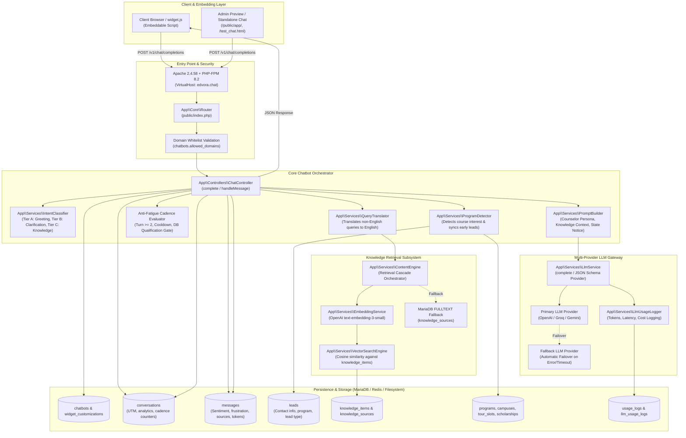
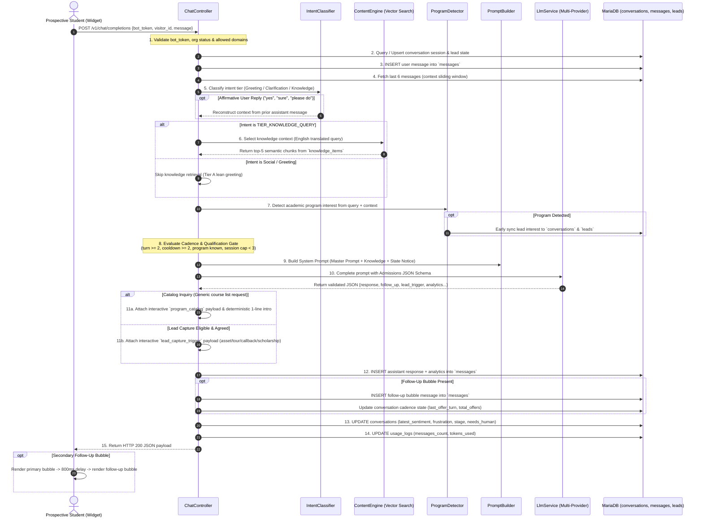
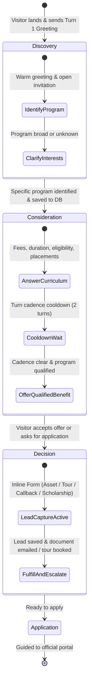
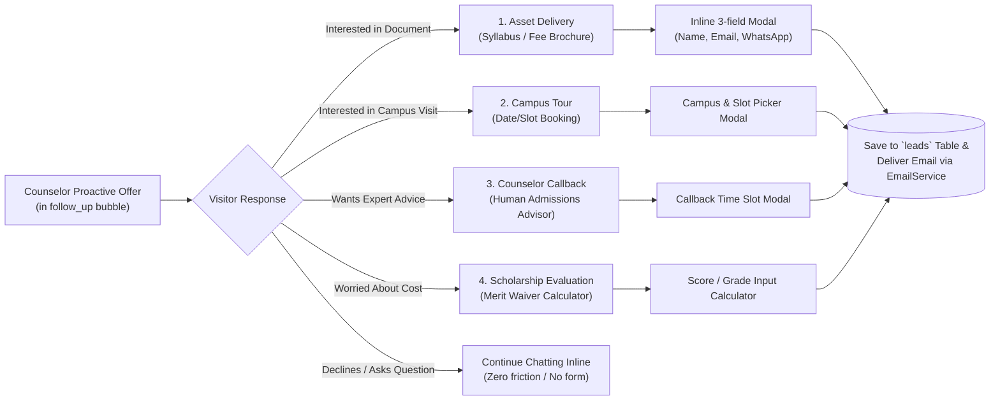
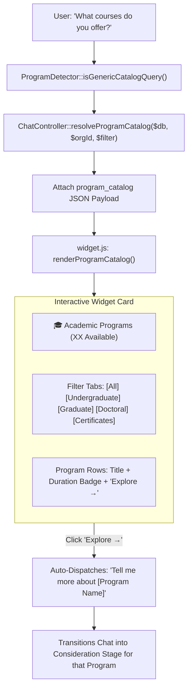
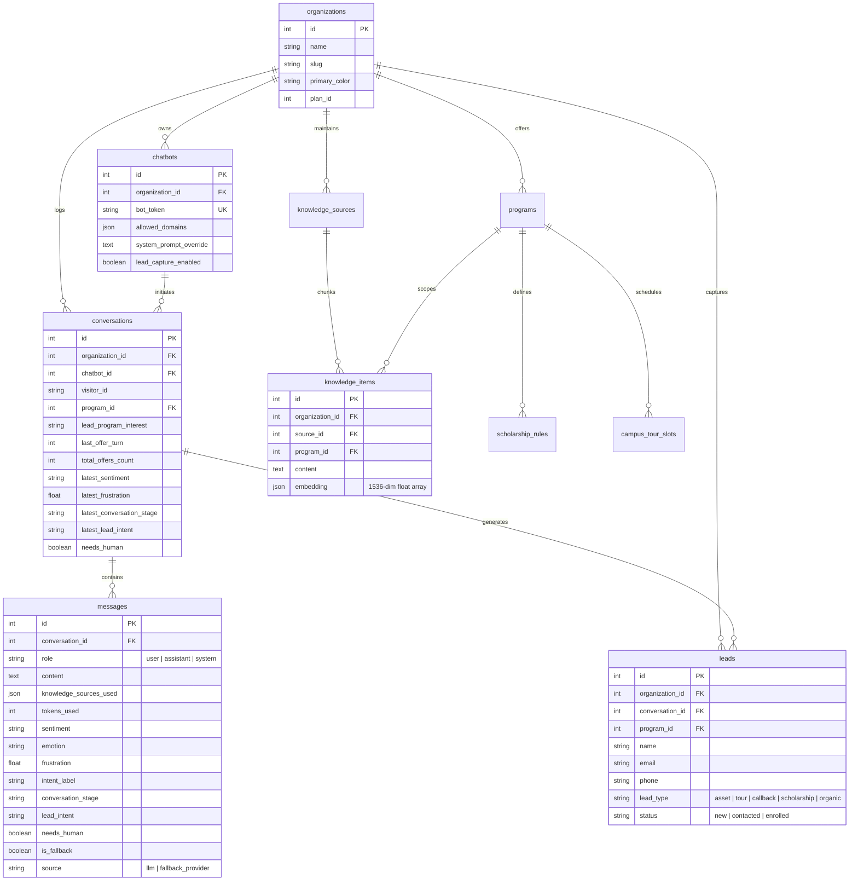

# Technical Architecture: Edvora Conversational AI & Admissions Chatbot

> **MANDATORY ONBOARDING & ARCHITECTURE GUIDE FOR HUMAN DEVELOPERS & AI CODING ASSISTANTS**
>
> This document is the canonical, authoritative technical architecture guide for the **Edvora Chatbot Subsystem**.
> It details the end-to-end chat lifecycle, vector retrieval engine, consultative counselor state machine, anti-fatigue lead conversion rules, structured JSON output contracts, client widget mechanics, and telemetry.
>
> **Companion Master Document:** [`architecture.md`](file:///c:/xampp/htdocs/edvora.chat/architecture.md)
> **Developer & Deployment Rules:** [`AGENTS.md`](file:///c:/xampp/htdocs/edvora.chat/AGENTS.md)
> **UI & Styling Guidelines:** [`BRANDING_GUIDELINES.md`](file:///c:/xampp/htdocs/edvora.chat/BRANDING_GUIDELINES.md)

---

## 1. Executive Summary & Core Design Philosophy

The **Edvora Chatbot** is a specialized, multi-tenant AI conversational agent designed specifically for higher-education recruitment and admissions. Unlike generic chatbots, the Edvora chatbot acts as an empathetic, consultative academic admissions counselor. It guides prospective students through program discovery, answers intricate academic questions using institutional knowledge, and converts high-intent prospects into qualified admissions leads.

### Core Architectural Principles:

1. **Structured Outputs Over Regex/Bracket Parsing:**
   The conversational engine strictly leverages native LLM `json_schema` outputs (`response_format` in OpenAI, Groq, and Gemini). Unreliable legacy bracket tags (`[FOLLOW_UP]`, `[LEAD_TRIGGER]`) are completely retired. Every response delivers clean text, secondary follow-up steering, conversational analytics, and UI trigger directives atomically.
2. **Consultative Counselor Mindset & Stage Progression:**
   The prompt architecture dynamically evaluates the prospect's stage in the admissions journey (`discovery` $\rightarrow$ `consideration` $\rightarrow$ `decision` $\rightarrow$ `application`) and adapts its conversational posture accordingly.
3. **Anti-Fatigue Cadence & Strict Program Qualification Gate:**
   Lead capture is never pushed aggressively. Turn 1 is strictly reserved for greeting and intent identification. Crucially, **proactive lead capture offers are strictly forbidden until the prospect's academic program interest has been identified and persisted in the database**. All offers follow strict cooldowns, session caps, and mandatory in-chat alternatives.
4. **Vector Retrieval with Program-Scoped Isolation:**
   Retrieval operates over self-contained semantic fact chunks in `knowledge_items` using 1536-dimensional OpenAI embeddings (`text-embedding-3-small`). When a visitor inquires about a specific program, vector search is isolated to that `program_id`, preventing cross-program information contamination or hallucination.
5. **Interactive Hybrid Widget UI:**
   The embeddable client (`widget.js`) delivers a modern UI combining conversational bubbles, separate delayed consultative follow-up bubbles, interactive lead capture forms, and tabbed academic program catalog cards with degree-level filters.

---

## 2. High-Level System Architecture

The following diagram illustrates the complete architectural topology of the Edvora chatbot subsystem:



---

## 3. End-to-End Chat Turn Lifecycle

Every incoming chat turn is processed synchronously by [`App\Controllers\ChatController::handleMessage()`](file:///c:/xampp/htdocs/edvora.chat/app/Controllers/ChatController.php) via route `POST /v1/chat/completions`.



### Detailed Turn Processing Steps:

1. **Authentication & Whitelist Validation:**
   Verifies `bot_token` against `chatbots`. Ensures `is_active = 1` and checks `chatbots.allowed_domains` against HTTP `Origin` / `Referer`.
2. **Session Resolution & Anti-Fatigue State:**
   Retrieves or creates the conversation in `conversations` using `visitor_id`. Reads current cadence indicators: `last_offer_turn`, `total_offers_count`, `lead_captured_at`, `lead_program_interest`, and `program_id`.
3. **User Message Logging:**
   Persists user prompt in `messages` with `role = 'user'`, `source = 'user'`, and timestamp.
4. **Context Sliding Window:**
   Extracts the last 6 messages (`LIMIT 6`, reversed) to maintain dialogue history without blowing context limits.
5. **Deterministic Intent Classification & Affirmative Lookback:**
   [`IntentClassifier::classify()`](file:///c:/xampp/htdocs/edvora.chat/app/Services/IntentClassifier.php) bins the turn into:
   - `TIER_CONVERSATIONAL`: Greetings, pleasantries, small talk. Knowledge retrieval is bypassed.
   - `TIER_CLARIFICATION`: Vague or single-word inputs. Generates targeted clarifying prompts.
   - `TIER_KNOWLEDGE_QUERY`: Substantive questions about admissions, fees, courses, placements, etc.
   - *Affirmative Context Lookback:* If the visitor says *"yes"*, *"sure"*, or *"please send it"*, the engine inspects the prior assistant message to determine what was offered.
6. **Query Translation & Knowledge Retrieval:**
   Non-English queries are translated to English via [`QueryTranslator`](file:///c:/xampp/htdocs/edvora.chat/app/Services/QueryTranslator.php) strictly for search indexing. [`ContentEngine::selectContext()`](file:///c:/xampp/htdocs/edvora.chat/app/Services/ContentEngine.php) executes vector search, scoped to `currentProgramId` if known.
7. **Proactive Program Interest Detection & Early Lead Sync:**
   [`ProgramDetector::detect()`](file:///c:/xampp/htdocs/edvora.chat/app/Services/ProgramDetector.php) scans query tokens against active `programs`. If identified, it synchronizes `conversations.lead_program_interest` and upserts an early lead record in `leads`.
8. **Offer Cadence & Qualification Gating:**
   Computes `$canMakeOffer`. If true, qualifies which specific offers are valid (brochure, tour, callback, scholarship).
9. **Dynamic Prompt Assembly:**
   [`PromptBuilder::build()`](file:///c:/xampp/htdocs/edvora.chat/app/Services/PromptBuilder.php) injects Master Prompt, College Profile, Knowledge Chunks, Active Programs, Campus Tours, and Turn State Directives.
10. **Structured LLM Invocation:**
    Calls [`LlmService::complete()`](file:///c:/xampp/htdocs/edvora.chat/app/Services/LlmService.php) with the strict Admissions Response JSON Schema.
11. **JSON Decoding & Fail-Safe Normalization:**
    Extracts `response`, `follow_up`, `lead_trigger`, `program_trigger`, and all analytics fields. If the LLM returns invalid JSON, a robust regex fallback cleans code fences, or defaults to treating raw text as the response.
12. **Trigger Resolution:**
    - Resolves `lead_trigger` into an actionable form payload (`resolveLeadTrigger`).
    - Resolves `program_trigger` into tabbed course cards (`resolveProgramCatalog`).
13. **Response Persistence & Cadence Update:**
    Saves assistant message and follow-up message to `messages` with sentiment, emotion, frustration, intent, and fallback metadata. Updates `conversations` summary columns.
14. **Usage Accounting:**
    Increments `usage_logs.messages_count` and `tokens_used` for billing.
15. **Dispatch to Client:**
    Emits unified JSON response to `widget.js`.

---

## 4. Structured Admissions Output Contract & Response Schema

Edvora enforces strict JSON schema mode on all chat completions. The schema is defined in [`LlmService::getAdmissionsResponseSchema()`](file:///c:/xampp/htdocs/edvora.chat/app/Services/LlmService.php).

### 4.1 Schema Definition

```json
{
  "name": "admissions_response",
  "strict": true,
  "schema": {
    "type": "object",
    "additionalProperties": false,
    "required": [
      "response",
      "follow_up",
      "lead_trigger",
      "program_trigger",
      "sentiment",
      "emotion",
      "frustration",
      "conversation_trend",
      "intent",
      "conversation_stage",
      "lead_intent",
      "needs_human"
    ],
    "properties": {
      "response": {
        "type": "string",
        "description": "Primary conversational answer bubble. Direct, accurate, friendly."
      },
      "follow_up": {
        "type": ["string", "null"],
        "description": "Secondary proactive counselor bubble. Proposes next step or qualified offer."
      },
      "lead_trigger": {
        "type": ["string", "null"],
        "enum": ["asset_delivery", "campus_tour", "counselor_callback", "scholarship_eval", null],
        "description": "Fires ONLY when visitor explicitly agrees to or requests an offer."
      },
      "program_trigger": {
        "type": ["string", "null"],
        "enum": ["all", "undergraduate", "graduate", "doctoral", "certificates", null],
        "description": "Fires when visitor asks for course catalog / list of programs."
      },
      "sentiment": {
        "type": "string",
        "enum": ["positive", "neutral", "negative"]
      },
      "emotion": {
        "type": "string",
        "description": "e.g. interested, confused, stressed, excited, anxious"
      },
      "frustration": {
        "type": "number",
        "description": "Float from 0.0 (completely calm) to 1.0 (highly frustrated)"
      },
      "conversation_trend": {
        "type": "string",
        "enum": ["improving", "stable", "declining"]
      },
      "intent": {
        "type": "string",
        "description": "Concise intent label (e.g. fee_inquiry, eligibility_check, catalog_browse)"
      },
      "conversation_stage": {
        "type": "string",
        "enum": ["discovery", "consideration", "decision", "application"]
      },
      "lead_intent": {
        "type": "string",
        "enum": ["low", "medium", "high"]
      },
      "needs_human": {
        "type": "boolean",
        "description": "True if visitor expresses extreme frustration, human request, or complex complaint"
      }
    }
  }
}
```

### 4.2 Multi-Bubble UI Model
- **Bubble 1 (`response`)**: Directly answers the user's explicit question using verified knowledge base facts.
- **Bubble 2 (`follow_up`)**: Rendered **800ms later** in the widget with a natural typing indicator bounce. It acts as the counselor's voice, nudging the prospect toward the next milestone in their journey.

---

## 5. The Consultative Counselor State Machine

The chatbot operates using a consultative counseling model rather than aggressive sales tactics.



### Dynamic Counselor Directives (Injected via `{{TURN_STATE}}`):

1. **State 1: Catalog Inquiry (`$isCatalogQuery = true`)**:
   - Directive: Visitor is browsing courses. System displays the interactive catalog UI. The LLM sets `"response": null`, `"follow_up": null`, and classifies degree level in `"program_trigger"`.
2. **State 2: Lead Already Captured (`$leadCaptured = true`)**:
   - Directive: Contact details are already collected. Answer all questions thoroughly and warmly. **Zero offers**.
3. **State 3: Discovery Stage (Program Unknown)**:
   - Directive: Prospect has not specified a program. If they ask about fees generally (*"What are the fees?"*), ask which program they want details for. **Zero offers**.
4. **State 4: Cooldown In Effect (`$canMakeOffer = false`)**:
   - Directive: Answer question regarding their program directly. Anti-fatigue cooldown active. **No offer this turn**.
5. **State 5: Early Turn (`$turnCount < 2`)**:
   - Directive: Turn 1 rapport building. Greet warmly and answer. **Zero offers**.
6. **State 6: Consideration Stage (Offer Eligible)**:
   - Directive: Prospect is evaluating a specific program. Offer **ONE** verified available benefit in `follow_up`, strictly enforcing the **Mandatory Pairing Rule**.

---

## 6. Lead Conversion Engine & Anti-Fatigue Cadence

Edvora solves the problem of "bot fatigue" through programmatic guardrails.

### 6.1 The 5 Golden Rules of Lead Capture:

| Rule | Enforcement | Rationale |
|---|---|---|
| **1. Program Qualification Gate** | `hasProgramLeadInDb === true` | Never offer a syllabus, tour, or callback if we don't know what program the student wants. |
| **2. Zero Turn 1 Offers** | `$turnCount >= 2` | Early pushiness repels prospective students. |
| **3. Cooldown Cadence** | `($turnCount - $lastOfferTurn) >= 2` | Minimum 2 regular Q&A turns between proactive offers. |
| **4. Session Cap** | `$totalOffersCount < 3` | Hard ceiling of 3 offers per session to prevent annoyance. |
| **5. Mandatory Pairing Rule** | Enforced in System Prompt | Every offer must offer an alternative to continue chatting right here. |

### 6.2 The 4 Conversational Lead Modalities:



1. **Asset Delivery (`asset_delivery`)**:
   - Available only if an active document with `lead_magnet = 1` exists in `knowledge_sources` for that program.
   - Form fields: Full Name, Email, Phone/WhatsApp.
   - Upon submission: Triggers [`POST /v1/assets/{id}/deliver`](file:///c:/xampp/htdocs/edvora.chat/app/Controllers/AssetController.php), sending a branded email with the PDF attachment via [`EmailService`](file:///c:/xampp/htdocs/edvora.chat/app/Services/EmailService.php).
   - *Returning Visitor Bypass:* If the lead is already captured in `localStorage`, the document is dispatched instantly with 1 click without displaying the form again.
2. **Campus Tour Scheduling (`campus_tour`)**:
   - Available only if active slots exist in `campus_tour_slots` for that program/campus.
   - Renders interactive campus selector and date/time slot picker.
3. **Admissions Counselor Callback (`counselor_callback`)**:
   - Connects the student to a human admissions counselor for personalized guidance.
4. **Merit Scholarship Evaluation (`scholarship_eval`)**:
   - Available only if active scholarship rules exist in `scholarship_rules` for that program.
   - Collects 12th/UG marks or entrance exam score and provides instant estimated scholarship percentage.

---

## 7. Interactive Program Catalog Experience (`program_trigger`)

When a visitor asks broad questions such as *"What programs do you have?"*, *"Show me your courses"*, or *"What are your MBA and BBA fees?"*, standard LLMs generate overwhelming walls of text. 

Edvora replaces text dumps with the **Interactive Program Catalog**:



### Degree Level Classification:
The engine parses keywords or uses the LLM's `program_trigger` property:
- `undergraduate`: B.Tech, BBA, BCA, B.Sc, BA, MBBS
- `graduate`: MBA, M.Tech, MCA, M.Sc, MA
- `doctoral`: Ph.D, Fellowship
- `certificates`: Executive Diplomas, Online Certifications

---

## 8. Knowledge Ingestion & Vector Retrieval Subsystem

The Edvora chatbot uses a pure vector similarity retrieval pipeline (no vector database service required; vectors are stored directly in MariaDB with PHP-accelerated cosine similarity).

```mermaid
flowchart TD
    subgraph Ingestion["Ingestion Pipeline (Offline / Async)"]
        Doc[PDF / DOCX / URL / Program Row] --> Parser["DocumentParser / ProgramTextGenerator"]
        Parser --> Chunker["App\\Services\\KnowledgeChunker"]
        Chunker -->|300-500 char self-identifying chunks| Chunks["Sentence Chunks"]
        Chunks --> Embedder["App\\Services\\EmbeddingService<br/>(OpenAI text-embedding-3-small)"]
        Embedder -->|1536-dim vector| KI_Insert[("INSERT knowledge_items<br/>(content, embedding JSON)")]
    end

    subgraph Runtime["Runtime Retrieval Pipeline (Chat Turn)"]
        VisitorMsg["Visitor Query (e.g. 'What is the MBA fee?')"]
        VisitorMsg --> Translate["QueryTranslator::translateToEnglish()"]
        Translate --> EmbedQuery["EmbeddingService::embed($query)"]
        EmbedQuery --> VectorSearch["App\\Services\\VectorSearchEngine::findClosest()"]
        
        VectorSearch --> SQLFilter["SELECT content, embedding FROM knowledge_items<br/>WHERE org_id = :org AND program_id = :prog"]
        SQLFilter --> CosineSim["Compute Cosine Similarity in PHP<br/>(Threshold >= 0.30, Top-K = 5)"]
        CosineSim --> RankedChunks["Top-5 Knowledge Chunks"]
        
        RankedChunks --> PromptContext["PromptBuilder: Injected into {{KNOWLEDGE_CONTEXT}}"]
    end
```



### 8.1 Self-Identifying Chunk Architecture:
A fundamental rule of Edvora's knowledge base is that every chunk stored in `knowledge_items` must be **self-contained and self-identifying**:
- **BAD (Unbound context):** `Duration: 2 years. Tuition is $32,000.`
- **GOOD (Self-identifying):** `MBA Program — Duration: 2 years. MBA Program — Tuition: $32,000 USD.`

This guarantees that vector similarity scoring accurately matches the query without losing context when isolated from surrounding paragraphs.

### 8.2 Retrieval Cascade:
1. **Tier 1 (Vector Search):** High-precision cosine similarity over `knowledge_items` (scoped by program if known).
2. **Tier 2 (FULLTEXT Fallback):** MariaDB `MATCH(title) AGAINST(:query IN NATURAL LANGUAGE MODE)` on `knowledge_sources` if no vector matches meet the 0.30 threshold.
3. **Tier 3 (LIKE Fallback):** Substring matching as a safety net.

---

## 9. Widget Client Architecture (`widget.js`)

The front-facing chatbot interface is delivered via a lightweight, zero-dependency, pure JavaScript bundle located at [`public/widget.js`](file:///c:/xampp/htdocs/edvora.chat/public/widget.js).

### 9.1 Script Tag Embed & Config Cascade:
```html
<script 
  src="https://edvora.chat/widget.js" 
  data-bot-token="YOUR_BOT_TOKEN" 
  data-is-test="false" 
  async>
</script>
```

Upon loading, `widget.js`:
1. Extracts `data-bot-token`.
2. Resolves or generates a persistent `visitor_id` stored in `localStorage` (`edvora_visitor_{token}`).
3. Calls `GET /v1/widget/config/{bot_token}`, which resolves dynamic styling with a 3-layer fallback:
   - Tenant Customizations (`widget_customizations` table)
   - Chatbot Instance Settings (`chatbots` table)
   - Organization Default Brand Colors & Logo (`organizations` table)

### 9.2 Key Client Subsystems:
- **Typing Indicator Manager:** Displays animated bounce bubbles (`#edvoraTyping`) during asynchronous fetch calls.
- **Delayed Follow-up Bubble Dispatcher:** If `follow_up_message` is present in the response, delays rendering by 800ms to mimic human cadence.
- **Action Badges in Header/Footer:** Badges for *"Download Syllabus"*, *"Book Campus Tour"*, and *"Request Callback"* are rendered dynamically only if the institution has active records in the database.
- **Dynamic Quick Chips:** Configurable starter question chips in the launcher window.

---

## 10. Database Schema & Data Dictionary



---

## 11. Multi-Provider LLM Gateway & Observability

All LLM operations pass through [`App\Services\LlmService`](file:///c:/xampp/htdocs/edvora.chat/app/Services/LlmService.php).

### 11.1 Super Admin Multi-Provider Failover:
1. Queries `llm_providers` for `role = 'primary'` and `is_active = 1`.
2. Dispatches completion using AES-256 decrypted API keys.
3. If primary fails (timeout, rate limit, HTTP 5xx), automatically falls back to `role = 'fallback'`.
4. If fallback fails, falls back to environment variables (`OPENAI_API_KEY`, `GEMINI_API_KEY`).
5. Tracks which provider serviced the turn in `messages.is_fallback` and `messages.source`.

### 11.2 Telemetry & Token Accounting:
Every turn is recorded in `llm_usage_logs` via [`LlmUsageLogger`](file:///c:/xampp/htdocs/edvora.chat/app/Services/LlmUsageLogger.php):
- Prompt tokens, completion tokens, total tokens
- Latency in milliseconds
- Cost calculated based on provider rate cards
- Status: `success` or `fallback`

---

## 12. Developer & AI Coding Assistant Quickstart Guide

### 12.1 Key Service File Reference:

| File Path | Role & Key Responsibilities |
|---|---|
| [`app/Controllers/ChatController.php`](file:///c:/xampp/htdocs/edvora.chat/app/Controllers/ChatController.php) | Orchestrates the turn lifecycle, checks cadence, resolves triggers, persists messages. |
| [`app/Services/PromptBuilder.php`](file:///c:/xampp/htdocs/edvora.chat/app/Services/PromptBuilder.php) | Constructs system prompts with counselor mindset, knowledge chunks, and state notices. |
| [`app/Services/LlmService.php`](file:///c:/xampp/htdocs/edvora.chat/app/Services/LlmService.php) | Manages LLM connections, JSON schema enforcement, key decryption, and failovers. |
| [`app/Services/IntentClassifier.php`](file:///c:/xampp/htdocs/edvora.chat/app/Services/IntentClassifier.php) | Classifies turns (Greeting vs. Clarification vs. Knowledge) and handles affirmative responses. |
| [`app/Services/ProgramDetector.php`](file:///c:/xampp/htdocs/edvora.chat/app/Services/ProgramDetector.php) | Detects program mentions, catalog inquiries, and syncs early leads to DB. |
| [`app/Services/VectorSearchEngine.php`](file:///c:/xampp/htdocs/edvora.chat/app/Services/VectorSearchEngine.php) | Executes cosine similarity search over `knowledge_items` with program scoping. |
| [`app/Services/EmbeddingService.php`](file:///c:/xampp/htdocs/edvora.chat/app/Services/EmbeddingService.php) | Generates 1536-dim embeddings via OpenAI API. |
| [`app/Services/QueryTranslator.php`](file:///c:/xampp/htdocs/edvora.chat/app/Services/QueryTranslator.php) | Translates non-English queries to English for retrieval indexing. |
| [`public/widget.js`](file:///c:/xampp/htdocs/edvora.chat/public/widget.js) | Embeddable front-end client rendering bubbles, triggers, catalog cards, and modals. |

### 12.2 Rules for Developers & AI Assistants:
1. **Never attempt local execution:** There is NO local PHP or MySQL on the development machine. All tests and migrations run on the remote VPS (`166.1.2.112`).
2. **Deploy atomically:** Always run `powershell -ExecutionPolicy Bypass -File .\deploy.ps1 -Message "..."` after changes.
3. **Preserve JSON Schema integrity:** If you modify `LlmService::getAdmissionsResponseSchema()`, you MUST update `ChatController.php` decoding, `messages` column mappings, and `widget.js` rendering simultaneously.
4. **Respect multi-tenancy:** Never query `conversations`, `messages`, `leads`, or `knowledge_items` without `WHERE organization_id = :org_id`.
5. **Honor the Anti-Fatigue Cadence:** Never remove the program qualification check or turn minimums from `ChatController.php`—these prevent aggressive chatbot behavior.

---

*Document Authoritative Date: September 2026*  
*Edvora AI Engineering Team*
