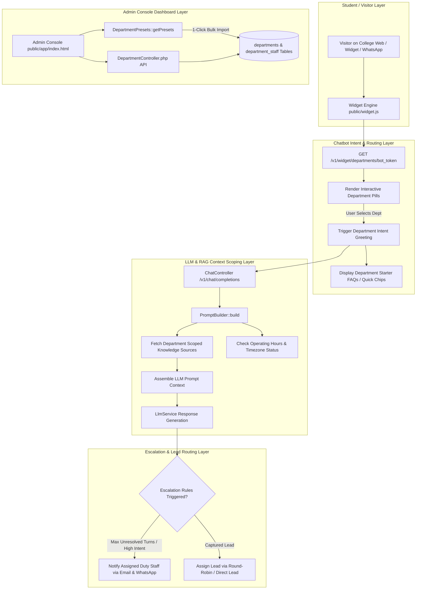

# Architecture Specification: Department & Team Management System

### Project: edvora.chat — AI Chatbot SaaS for Colleges & Universities

---

## 🎯 Executive Summary & Purpose

The **Department & Team Management System** provides college admissions offices, university departments, and support desks with a fully automated, pre-configured structure to manage student inquiries, staff assignments, knowledge base scoping, multi-channel contact handles, operating hours, auto-escalations, and lead routing.

To eliminate setup friction, the system provides **14 Pre-Built Department Templates** out-of-the-box while giving administrators complete freedom to customize any pre-built department or create custom departments.

---

## 🏗️ Technical Architecture Diagram



---

## 🏛️ 1. Pre-Built Department Catalog (14 Presets)

The system includes 14 pre-built department templates defined in [`app/Database/DepartmentPresets.php`](file:///c:/xampp/htdocs/edvora.chat/app/Database/DepartmentPresets.php). Admins can launch all 14 presets with 1-click or selectively import specific departments.

| Preset Slug | Department Name | Icon | Typical Enquiries / Intent Triggers | Default Chatbot Menu Greeting |
| :--- | :--- | :--- | :--- | :--- |
| `mba-admissions` | **MBA Admissions** | 🎓 | Eligibility, application guidelines, deadlines, entrance exam cutoffs | *"I can help with MBA Admissions. Would you like information about eligibility, fees, scholarships, or the application process?"* |
| `fees-finance` | **Fees & Finance** | 💰 | Tuition fee structure, installment plans, education loans, EMI options, online payment links | *"I can assist with Fees & Payments. Are you looking for fee structures, EMI options, or online payment details?"* |
| `application-support` | **Application Support** | 📝 | Help with online form filling, document upload errors, registration status | *"I can guide your application process. Do you need help filling out forms or checking application status?"* |
| `programs-academics` | **Programs & Courses** | 🏫 | MBA, PGDM, Executive MBA, specializations, AICTE/UGC accreditation | *"I can provide course details. Which program would you like to explore (MBA, PGDM, Executive MBA)?"* |
| `hostel-housing` | **Hostel & Housing** | 🛏️ | Room options (AC/Non-AC), mess facilities, annual fees, security | *"I can share hostel details. Would you like info on room fees, mess menus, or availability?"* |
| `international-admissions` | **International Admissions** | 🌍 | Foreign national eligibility, student visa support, NRI quota | *"Welcome international applicant! I can help with visa compliance, NRI quota, or English proficiency requirements."* |
| `placements-careers` | **Placements & Careers** | 💼 | Highest & average CTC, recruiting companies, placement statistics | *"Interested in career outcomes? I can show placement highlights, top recruiting companies, and average packages."* |
| `scholarships-aid` | **Scholarships & Aid** | 🎓 | Merit scholarships, financial aid, fee waivers, sports quota | *"We offer several scholarships! Would you like to check eligibility for merit or need-based financial aid?"* |
| `academics-faculty` | **Academics & Faculty** | 📚 | Curriculum syllabus, faculty background, guest lectures, exam timetable | *"I can answer academic queries. Need info about faculty profiles, curriculum details, or term schedules?"* |
| `campus-visit` | **Campus Visit & Tours** | 📍 | Guided campus tour booking, open house events, directions | *"We'd love to host you on campus! Would you like to schedule a physical tour or get directions?"* |
| `student-services` | **Student Services** | 🧑‍🎓 | Transcripts, student ID cards, bonafide certificates, library | *"For enrolled students, I can direct you to transcript requests, ID cards, or campus services."* |
| `corporate-relations` | **Corporate Relations** | 🤝 | Industry partnerships, corporate campus recruitment, MoUs | *"Connecting with our corporate office? I can route your inquiry to our Placement & Partnership cell."* |
| `marketing-outreach` | **Marketing & Outreach** | 📢 | Webinars, info sessions, education fair participation, brochures | *"Stay connected! Would you like to download our latest prospectus or register for upcoming webinars?"* |
| `alumni-relations` | **Alumni Network** | 🏛️ | Alumni directory, guest mentoring, reunions, transcript services | *"Welcome back! I can connect you with alumni relations, transcript issuance, or upcoming reunions."* |

---

## 🗄️ 2. Database Schema Specification

### 2.1 `departments` Table
Stores basic metadata, contact handles, working hours, auto-away responses, escalation rules, and lead assignment policies.

```sql
CREATE TABLE IF NOT EXISTS departments (
    id INT AUTO_INCREMENT PRIMARY KEY,
    organization_id INT NOT NULL,
    name VARCHAR(255) NOT NULL,
    slug VARCHAR(255) NOT NULL,
    icon VARCHAR(50) DEFAULT '🏫',
    description TEXT NULL,
    email VARCHAR(255) NULL,
    phone VARCHAR(50) NULL,
    whatsapp VARCHAR(50) NULL,
    working_hours JSON NULL COMMENT 'Day-wise schedule: {"mon":{"open":"09:00","close":"17:00","active":true}}',
    timezone VARCHAR(50) DEFAULT 'Asia/Kolkata',
    auto_away_message TEXT NULL,
    escalation_rules JSON NULL COMMENT 'Rules: {"max_unresolved_turns": 2, "notify_email": true, "notify_whatsapp": true}',
    lead_assignment_rules JSON NULL COMMENT 'Method: {"method": "round_robin"|"direct"}',
    greeting_message TEXT NULL,
    is_active TINYINT(1) DEFAULT 0,
    enable_dedicated_widget TINYINT(1) DEFAULT 0,
    is_preset TINYINT(1) DEFAULT 0,
    created_at TIMESTAMP DEFAULT CURRENT_TIMESTAMP,
    updated_at TIMESTAMP DEFAULT CURRENT_TIMESTAMP ON UPDATE CURRENT_TIMESTAMP,
    FOREIGN KEY (organization_id) REFERENCES organizations(id) ON DELETE CASCADE,
    UNIQUE KEY org_dept_slug (organization_id, slug)
) ENGINE=InnoDB DEFAULT CHARSET=utf8mb4 COLLATE=utf8mb4_unicode_ci;
```

### 2.2 `department_staff` Pivot Table
Maps organization staff members to specific departments with roles (`lead`, `agent`) and on-duty status.

```sql
CREATE TABLE IF NOT EXISTS department_staff (
    id INT AUTO_INCREMENT PRIMARY KEY,
    department_id INT NOT NULL,
    user_id INT NOT NULL,
    role ENUM('lead', 'agent') DEFAULT 'agent',
    is_on_duty TINYINT(1) DEFAULT 1,
    created_at TIMESTAMP DEFAULT CURRENT_TIMESTAMP,
    FOREIGN KEY (department_id) REFERENCES departments(id) ON DELETE CASCADE,
    FOREIGN KEY (user_id) REFERENCES users(id) ON DELETE CASCADE,
    UNIQUE KEY dept_user (department_id, user_id)
) ENGINE=InnoDB DEFAULT CHARSET=utf8mb4 COLLATE=utf8mb4_unicode_ci;
```

### 2.3 `department_knowledge` Pivot Table
Filters which Knowledge Base documents/sources power context retrieval for a specific department.

```sql
CREATE TABLE IF NOT EXISTS department_knowledge (
    department_id INT NOT NULL,
    knowledge_source_id INT NOT NULL,
    PRIMARY KEY (department_id, knowledge_source_id),
    FOREIGN KEY (department_id) REFERENCES departments(id) ON DELETE CASCADE,
    FOREIGN KEY (knowledge_source_id) REFERENCES knowledge_sources(id) ON DELETE CASCADE
) ENGINE=InnoDB DEFAULT CHARSET=utf8mb4 COLLATE=utf8mb4_unicode_ci;
```

### 2.4 `department_faqs` Table
Stores preset questions and answers for department starter quick chips in the chatbot widget.

```sql
CREATE TABLE IF NOT EXISTS department_faqs (
    id INT AUTO_INCREMENT PRIMARY KEY,
    department_id INT NOT NULL,
    question VARCHAR(500) NOT NULL,
    answer TEXT NOT NULL,
    keywords JSON NULL,
    sort_order INT DEFAULT 0,
    created_at TIMESTAMP DEFAULT CURRENT_TIMESTAMP,
    FOREIGN KEY (department_id) REFERENCES departments(id) ON DELETE CASCADE
) ENGINE=InnoDB DEFAULT CHARSET=utf8mb4 COLLATE=utf8mb4_unicode_ci;
```

---

## 🔌 3. REST API Endpoint Registry

All backend endpoints are handled by [`app/Controllers/DepartmentController.php`](file:///c:/xampp/htdocs/edvora.chat/app/Controllers/DepartmentController.php) and registered in [`public/index.php`](file:///c:/xampp/htdocs/edvora.chat/public/index.php).

| Method | Endpoint | Protection | Description |
| :--- | :--- | :--- | :--- |
| `GET` | `/v1/departments` | Auth + Tenant | Fetch all departments with assigned staff, knowledge sources, and FAQs. |
| `GET` | `/v1/departments/presets` | Auth + Tenant | Get list of 14 pre-built department template specifications for catalog picker. |
| `POST` | `/v1/departments/preset-import` | Auth + Tenant | 1-click bulk import of selected preset departments into organization database. |
| `POST` | `/v1/departments` | Auth + Tenant | Create custom department. |
| `PUT` | `/v1/departments/{id}` | Auth + Tenant | Update department basic info, contact handles, working hours, and rules. |
| `DELETE` | `/v1/departments/{id}` | Auth + Tenant | Delete department. |
| `POST` | `/v1/departments/{id}/staff` | Auth + Tenant | Sync assigned staff members and duty status. |
| `POST` | `/v1/departments/{id}/knowledge` | Auth + Tenant | Sync linked knowledge sources. |
| `POST` | `/v1/departments/{id}/faqs` | Auth + Tenant | Manage department FAQs and quick starter chips. |
| `GET` | `/v1/widget/departments/{bot_token}` | Public | Public widget API to fetch active department pills and starter quick chips. |

---

## 🎨 4. Admin Console & Chatbot Widget Integration

### 4.1 Admin Console SPA (`public/app/index.html`)
- **Departments & Teams Sidebar Item (`🏢`)**: Located under Navigation section.
- **Summary Stats Cards**: Real-time counts of Active Departments, Duty Staff, Scoped Knowledge Sources, and Escalation Rules.
- **1-Click Presets Modal (`#presetsModal`)**: Card layout allowing bulk selection and import of pre-built templates.
- **Department Config Modal (`#departmentModal`)**: 6 sub-tabs:
  1. *General & Contact*: Icon, Name, Description, Email, Phone, WhatsApp, Chatbot Greeting.
  2. *Knowledge Scope*: Checkbox list of org knowledge sources.
  3. *Assigned Staff*: Staff list with duty toggles.
  4. *Hours & Away*: Timezone and off-duty away response.
  5. *Escalations & Leads*: Email/WhatsApp notification toggles and lead assignment logic (Round Robin).
  6. *FAQs & Quick Chips*: Interactive question & answer chip builder.

### 4.2 Embedded Chatbot Widget (`public/widget.js`)
- On widget initialization, fetches active departments from `/v1/widget/departments/{bot_token}`.
- Renders interactive pill buttons for each active department in the chat window.
- Clicking a department pill triggers the customized department greeting (e.g. *"I can help with MBA Admissions. Would you like information about eligibility, fees, scholarships, or the application process?"*).
- Displays starter quick chips (`❓ Question`) for preset department FAQs with instant answers.

---

## 🛠️ 5. Maintenance & Bug Fixing Checklist

When applying updates or fixing bugs on Department / Team Management:
1. **Database Schema Changes**: Always update `17. DEPARTMENTS` and related table queries in [`app/Database/Migrations.php`](file:///c:/xampp/htdocs/edvora.chat/app/Database/Migrations.php).
2. **Preset Template Updates**: Modify [`app/Database/DepartmentPresets.php`](file:///c:/xampp/htdocs/edvora.chat/app/Database/DepartmentPresets.php).
3. **API Logic**: Check [`app/Controllers/DepartmentController.php`](file:///c:/xampp/htdocs/edvora.chat/app/Controllers/DepartmentController.php).
4. **Prompt Context Assembly**: Inspect [`app/Services/PromptBuilder.php`](file:///c:/xampp/htdocs/edvora.chat/app/Services/PromptBuilder.php).
5. **Widget Pill Rendering**: Verify rendering functions in [`public/widget.js`](file:///c:/xampp/htdocs/edvora.chat/public/widget.js).
