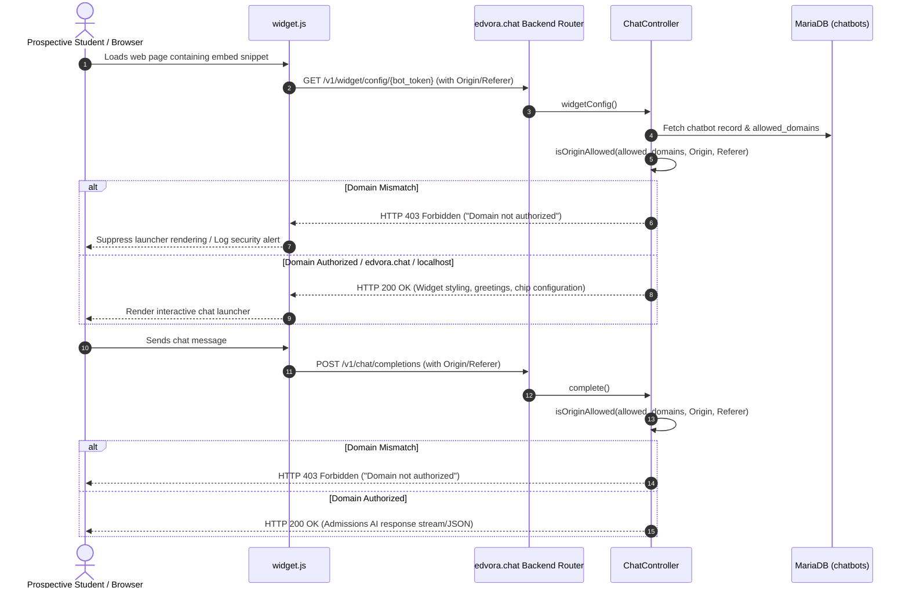

# Architecture & Specification: Domain Whitelisting & Embed Origin Security

> **Document Type:** Canonical Subsystem Architecture  
> **Status:** Active / Production Verified  
> **Audience:** Core Engineers, AI Coding Assistants, System Architects  

---

## 1. Executive Overview & Problem Statement

### 1.1 Context
In **edvora.chat**, colleges and universities embed their custom AI admissions assistant into their web portals using an asynchronous HTML snippet:
```html
<script src="https://edvora.chat/widget.js" data-bot-token="bot_xxxxxxxxxxxxxxxx" async></script>
```
Because `data-bot-token` is publicly inspectable in client-side HTML, unauthenticated or unauthorized actors can copy a college's token and:
1. **Draining LLM Quotas:** Embed the chatbot on high-traffic unrelated websites or run automated bot scripts, consuming the institution's LLM generation budget.
2. **Proprietary Knowledge Scraping:** Systematically extract admissions cut-offs, fee discount matrices, and institutional policies using automated scrapers.
3. **Pipeline Contamination:** Inject spam leads, bogus counselor callbacks, and fake campus tour bookings into the admissions CRM.
4. **Brand Impersonation:** Embed the official university admissions bot on predatory or malicious educational portal sites.

### 1.2 Solution
The **Domain Whitelisting Engine** restricts chatbot widget rendering and AI chat completions exclusively to verified hostnames authorized by the institution.

---

## 2. Core Operational Principles

1. **Zero-Setup Default (Frictionless Onboarding):**
   When an institution registers, their official website URL entered during signup is automatically parsed, cleaned, and set as their initial whitelisted primary domain.
2. **Strict Quota Cap (Max 4 Domains):**
   Institutions can configure up to **4 authorized domains** (e.g., apex domain, admissions portal, alumni site, student portal). This prevents multi-institution account sharing while giving ample coverage for legitimate university subdomains.
3. **Subdomain & Wildcard Inheritance:**
   Whitelisting an apex domain (e.g., `apexuniversity.edu.in`) automatically covers:
   - `www.apexuniversity.edu.in`
   - Subdomains such as `admissions.apexuniversity.edu.in`, `apply.apexuniversity.edu.in`
   - Wildcards such as `*.apexuniversity.edu.in`
4. **Internal Testing Exemption:**
   Requests originating from `edvora.chat` (the administrative web console, live test studio, and preview frames) and local environments (`localhost`, `127.0.0.1`) are always permitted to allow administrators and developers to test bots without lockouts.
5. **Fail-Closed Enforcement:**
   When a chatbot has configured whitelisted domains, any request originating from an unlisted domain is rejected with HTTP `403 Forbidden` (`{"status":"error","message":"This domain is not authorized to embed this chatbot."}`).

---

## 3. Data Flow & Lifecycle Architecture



---

## 4. Database Schema & Storage

### 4.1 Table: `chatbots`
Whitelisted domains are stored directly in the `chatbots` table:

| Column | Type | Nullable | Default | Description |
|---|---|---|---|---|
| `allowed_domains` | `JSON` | YES | `NULL` | JSON array containing up to 4 clean hostnames (e.g., `["apex.edu.in", "admissions.apex.edu.in"]`). |

*Example Storage Format:*
```json
["apexuniversity.edu.in", "admissions.apexuniversity.edu.in", "apply.apexuniversity.edu.in"]
```

### 4.2 Automated Migration & Backfill
On migration execution ([`app/Database/Migrations.php`](file:///c:/xampp/htdocs/edvora.chat/app/Database/Migrations.php)), existing institutions without whitelisted domains are automatically backfilled using their `organizations.website_url`:
```sql
UPDATE chatbots c
JOIN organizations o ON c.organization_id = o.id
SET c.allowed_domains = JSON_ARRAY(
    LOWER(
        REPLACE(
            SUBSTRING_INDEX(
                SUBSTRING_INDEX(
                    REPLACE(REPLACE(o.website_url, 'https://', ''), 'http://', ''),
                    '/', 1
                ),
                ':', 1
            ),
            'www.', ''
        )
    )
)
WHERE (c.allowed_domains IS NULL OR c.allowed_domains = '[]' OR c.allowed_domains = '' OR c.allowed_domains = 'null')
  AND o.website_url IS NOT NULL 
  AND TRIM(o.website_url) != '';
```

---

## 5. REST API Contracts

### 5.1 Fetch Whitelisted Domains
* **Endpoint:** `GET /v1/organization/whitelisted-domains`
* **Auth:** Bearer Token (`AuthMiddleware`, `TenantMiddleware`)
* **Response (200 OK):**
```json
{
  "status": "success",
  "message": "Success",
  "data": {
    "domains": [
      "apex.edu.in",
      "admissions.apex.edu.in"
    ],
    "default_domain": "apex.edu.in",
    "max_allowed": 4,
    "bot_id": 33
  }
}
```

### 5.2 Update Whitelisted Domains
* **Endpoint:** `PUT /v1/organization/whitelisted-domains`
* **Auth:** Bearer Token (`AuthMiddleware`, `TenantMiddleware`)
* **Request Payload:**
```json
{
  "domains": [
    "apex.edu.in",
    "admissions.apex.edu.in",
    "portal.apex.edu.in"
  ]
}
```
* **Validation Rules:**
  - Strip protocol (`https://`, `http://`), paths (`/.*`), port numbers, and `www.` prefixes.
  - Lowercase all entries.
  - Reject payloads with more than 4 domains (`HTTP 422 Unprocessable Entity`).
  - Validate hostname structure (`^[a-z0-9.-]+\.[a-z]{2,}$` or `localhost`).
  - Log audit event `whitelisted_domains_updated` via `AuditLogger`.

---

## 6. Runtime Origin Matching Logic

The canonical matching algorithm is implemented in [`app/Controllers/ChatController.php`](file:///c:/xampp/htdocs/edvora.chat/app/Controllers/ChatController.php#L865):

```php
public static function isOriginAllowed(?string $allowedDomainsJson): bool
{
    if (empty($allowedDomainsJson)) {
        return true; // Permissive fallback if not yet configured
    }

    $allowed = json_decode($allowedDomainsJson, true);
    if (empty($allowed) || !is_array($allowed)) {
        return true;
    }

    $origin = $_SERVER['HTTP_ORIGIN'] ?? '';
    $referer = $_SERVER['HTTP_REFERER'] ?? '';

    $targetHost = '';
    if (!empty($origin)) {
        $parsed = parse_url($origin);
        $targetHost = strtolower($parsed['host'] ?? '');
    } elseif (!empty($referer)) {
        $parsed = parse_url($referer);
        $targetHost = strtolower($parsed['host'] ?? '');
    }

    // Direct API calls without Origin/Referer (e.g. backend curl or testing) are permitted
    if (empty($targetHost)) {
        return true;
    }

    // Always permit administrative preview & local developer environments
    if ($targetHost === 'edvora.chat' || str_ends_with($targetHost, '.edvora.chat') || $targetHost === 'localhost' || $targetHost === '127.0.0.1') {
        return true;
    }

    $targetHostClean = preg_replace('/^www\./', '', $targetHost);

    foreach ($allowed as $d) {
        $d = strtolower(trim((string)$d));
        if ($d === '') continue;
        $dClean = preg_replace('/^www\./', '', $d);

        // Exact match
        if ($targetHostClean === $dClean) {
            return true;
        }

        // Subdomain match (e.g. admissions.apex.edu matches apex.edu or *.apex.edu)
        if (str_starts_with($dClean, '*.')) {
            $root = substr($dClean, 2);
            if ($targetHostClean === $root || str_ends_with($targetHostClean, '.' . $root)) {
                return true;
            }
        } elseif (str_ends_with($targetHostClean, '.' . $dClean)) {
            return true;
        }
    }

    return false;
}
```

---

## 7. User Interface & Experience Architecture

### 7.1 Central Governance Card (`#org-settings`)
Located in [`public/app/tabs/org-settings.html`](file:///c:/xampp/htdocs/edvora.chat/public/app/tabs/org-settings.html):
- Positioned alongside *Institution Profile*, *Campus*, and *ChatBot Settings*.
- Visuals: Shield icon (`🛡️`), gradient header, status badges (`Origin Security`, `Embed Protection`, `Up to 4 Domains`).
- Interaction: Triggers `switchNavTab('domain-whitelist')`.

### 7.2 Dedicated Management Page (`#domain-whitelist`)
Located in [`public/app/tabs/domain-whitelist.html`](file:///c:/xampp/htdocs/edvora.chat/public/app/tabs/domain-whitelist.html):
- Visual structure identical to [`settings.html`](file:///c:/xampp/htdocs/edvora.chat/public/app/tabs/settings.html) (`ops-dashboard-frame`, top control bar with `← Control Panel` navigation button, live status dot, and domain counter pill `X / 4 Domains Configured`).
- Initial domain row tagged with **Primary**.
- **`+ Add Another Domain`** button dynamically inserts new rows with immediate focus.
- Delete buttons for non-primary rows.
- Dynamic hiding of `+ Add Another Domain` button once 4 rows exist.
- Save action with real-time toast feedback and validation.

### 7.3 Studio Subnav Link
Located in [`public/app/tabs/chatbot.html`](file:///c:/xampp/htdocs/edvora.chat/public/app/tabs/chatbot.html):
- The "Whitelist Domains" subtab pill directly links to `#domain-whitelist`.
